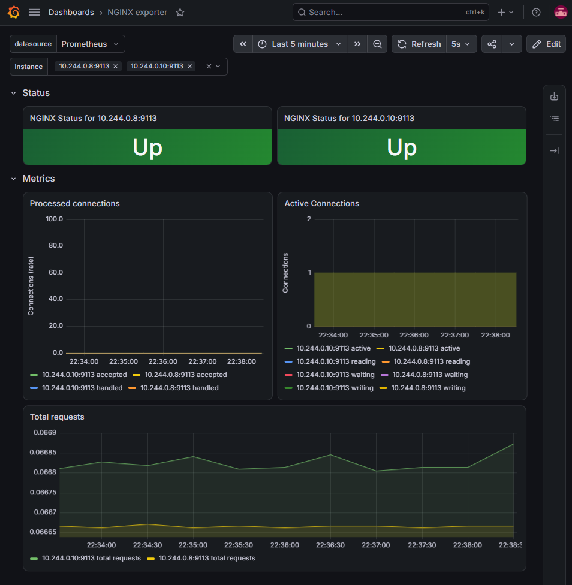

Комплексное и полностью воспроизводимое решение для хакатона MTC DevOps. Проект представляет собой архитектурно структурированный стек в Kubernetes, включающий демонстрационное веб-приложение, современную маршрутизацию через Gateway API, сбор метрик с помощью Prometheus и централизованное логирование через Filebeat.

---

## 1. Kubernetes-окружение и системные требования
Решение протестировано и гарантированно работает в следующих условиях:
* **Операционная система:** Ubuntu 24.04 LTS (в среде WSL2)
* **Инструмент развертывания кластера:** Minikube (с драйвером Docker)
* **Версия Kubernetes:** v1.30+
* **Предварительные требования на хосте:**
  - Docker
  - Minikube
  - `kubectl`

### Проверка состояния кластера:
Перед развертыванием убедитесь, что кластер запущен и доступен:
```bash
minikube status
kubectl cluster-info
kubectl get nodes
```
2. Демонстрационное веб-приложение
В качестве веб-приложения используется связка Nginx и сайдкар-экспортера nginx-prometheus-exporter.

Расположение манифестов: директория infra/app/

deployment.yaml — развертывание приложения (содержит основной контейнер Nginx и вспомогательный экспортер метрик).

service.yaml — внутренний сервис Kubernetes для маршрутизации трафика к подам.

configmap.yaml — конфигурационный файл Nginx с кастомным форматом логирования.

Функционал: приложение принимает HTTP-запросы, возвращает корректный HTTP-ответ (200 OK) и генерирует access/error логи в стандартный вывод (stdout), доступные для перехвата системой сбора логов.

3. Gateway API
Доступ к веб-приложению извне организован с помощью стандарта Kubernetes Gateway API с использованием реализации Envoy Gateway.

Используемые ресурсы (директория infra/gateway/):

GatewayClass (gatewayclass.yaml) — определяет класс контроллера (eg).

Gateway (gateway.yaml) — сетевой шлюз, принимающий входящий трафик.

HTTPRoute (httproute.yaml) — правило маршрутизации HTTP-трафика к сервису приложения web-app-service.

Как проверить доступность приложения:

```bash
# Выполнить запрос через настроенный локальный порт-форвард или шлюз
curl -i http://localhost:8080/
```
4. Мониторинг (Prometheus)
Инструмент: Prometheus (в связке с Prometheus Operator)

Сбор метрик: Настроен с помощью кастомного ресурса ServiceMonitor (infra/monitoring/app-servicemonitor.yaml), который автоматически обнаруживает эндпоинты метрик нашего приложения. Дополнительно задействован PodMonitor для Envoy Gateway.

### 📊 Grafana Dashboard As-Code
Для визуализации метрик веб-приложения и Nginx-экспортера в проекте предусмотрен готовый дашборд Grafana, экспортированный в формате JSON и поставляемый в виде кода.

- **Путь к файлу конфигурации в репозитории:** `infra/monitoring/dashboards/nginx-exporter.json`
- **Что отображает дашборд:**
  - Статус доступности таргетов (`Up / Down`).
  - Активные и обработанные соединения NGINX (`Active Connections`, `Processed connections`).
  - Общее количество HTTP-запросов и общую динамику нагрузки.
- **Интеграция:** Дашборд может быть импортирован в любой экземпляр Grafana, подключенный к Prometheus-источнику данных данного кластера, что обеспечивает полную воспроизводимость контура наблюдаемости (Observability).
- **Пример отображения дашборда:**


Как проверить:

Убедитесь, что ресурсы мониторинга успешно созданы в кластере:

```bash
kubectl get servicemonitor -A
```

Проверьте статус таргетов в панели Prometheus (целевые метрики экспортера должны находиться в статусе UP).

5. Логирование (Filebeat)
Инструмент: Filebeat, развернутый в виде DaemonSet в пространстве имен monitoring (infra/logging/filebeat-rbac.yaml).

Что собирается: access- и error-логи подов приложения из системной директории хоста /var/log/pods/.

Обработка: Настроено автоматическое декодирование полей JSON (decode_json_fields) и вывод обработанных логов в консоль (output.console).

Как проверить получение логов (пошаговая инструкция):

Убедитесь, что под Filebeat запущен и находится в статусе Running:

```
kubectl get pods -n monitoring -l app=filebeat
Запустите стриминг логов Filebeat в реальном времени:
```
```
kubectl logs -n monitoring -l app=filebeat -f
В соседнем окне терминала сгенерируйте HTTP-запрос к приложению:
```
```
curl -s http://localhost:8080 > /dev/null
В окне логов Filebeat мгновенно появится структура с данными о совершенном запросе.
```
6. Поддержка операционной системы
Решение полностью верифицировано и стабильно работает на Ubuntu 24.04 LTS. Все зависимости совместимы с данной ОС.

7. Автоматизация развертывания
Проект полностью автоматизирован с помощью скрипта деплоя deploy.sh. Развертывание не требует ручного создания или правки манифестов. Повторный запуск скрипта безопасен (idempotent).

Инструкция по развертыванию:

Запустите локальный кластер Minikube:

```
minikube start --driver=docker
Выполните скрипт автоматической установки из корневой директории репозитория:
```
```
./deploy.sh
```
Скрипт последовательно выполнит проверку подключения к кластеру, создаст необходимые пространства имен и применит все манифесты приложений, шлюзов, мониторинга и логирования в строгом порядке.

8. Структура репозитория
```Plaintext
mtc-devops-hack/
├── infra/
│   ├── app/                 # Манифесты веб-приложения (Deployment, Service, ConfigMap)
│   ├── gateway/             # Ресурсы Gateway API (GatewayClass, Gateway, HTTPRoute)
│   ├── monitoring/          # Конфигурации Prometheus (ServiceMonitor, PodMonitor)
│   └── logging/             # Конфигурация Filebeat (DaemonSet, RBAC, ConfigMap)
├── deploy.sh                # Автоматический скрипт деплоя
└── README.md                # Документация проекта
```
